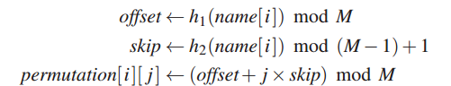
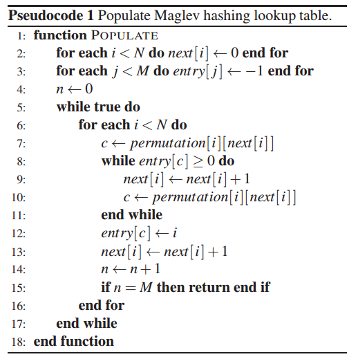
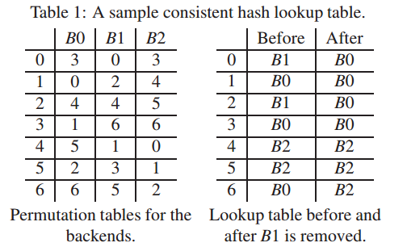
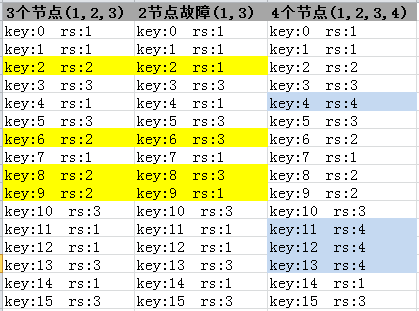

# maglev_hash 原始论文  
   一个根据google maglev 论文,用c语言实现的一致性hash算法  
   [Maglev: A Fast and Reliable Software Network Load Balancer](http://static.googleusercontent.com/media/research.google.com/zh-TW//pubs/archive/44824.pdf)

## 评价一致性hash的好坏，主要关注以下两点：
- 平衡性(Balance)：  
  平衡性是指哈希的结果能够尽可能分布到所有的节点中去，很多哈希算法都能够满足这一条件。
- 单调性(Monotonicity)：  
  单调性是指如果已经有一些内容通过哈希分派到了相应的节点，又有新的节点加入到系统中。
  哈希的结果应能够保证原有已分配的内容可以被映射到原有的或者新的节点中去，而不会被映射到旧的集合中的其他节点。

## maglev一致性hash算法实现：
- 构造permutation数组  
  根据不同的两个hash函数，我们生成两个数值（offset ，skip）  
  在这里我们使用的是murmur2算法和DJBHash算法，读者可以自己到网上找算法实现。  
  
  M = 一个hash槽大小 ，这个槽设置成一个素数  
  N=节点个数   
   
```text
unsigned int offset = DJBHash(p_rs_srv_name);
offset = offset % M;
unsigned int skip = ngx_murmur_hash2(p_rs_srv_name,strlen(p_rs_srv_name) );
skip = skip % ( M -1 ) + 1;
for(int j = 0; j &lt; M ; j++ ) {
  *(p_rs_info->m_permute + j) = (offset + j * skip) % M
}

```
生成hash查找桶entry

根据这个算法 ，数据源是 permutation , 生成 最后的 entry 数组 ，就是下图的表。


## maglev一致性hash测试

 下表是测试情况：  
> 1. 正常三个节点时，通过一致性hash负载的分布情况，测试平衡性。  
> 2. 有单点故障时，流量变化情况（2节点故障），测试单调性。  
> 3. 增加一个节点时，其他节点流量的变化情况，测试单调性。  

### 单调性测试 
> M = 2017, real server = 4 删除一个rs = 3后，前后entry（lookup table）槽对比， hash size = 2017  
> delete:504, 由于单点故障，故障点的请求都被分流了，删除的节点有504个槽  
> interupt:10, 其他槽中有10个漂移到其他rs上去了。  
> 这样算下来有： （2017-10）/2017 = 99.5% 违背的单调性  

 
 
 
# Maglev Hash与Consistent Hashing的对比

- 平衡性(Balance)
> maglev hash通过轮询放入loopup table（entry）数组，保证每个节点的机会是均衡的。  
> consistent hash 通过增加虚拟节点的倍数来保证平衡性，虚拟节点的倍数越高平衡性越好。  
> 缺点就是consistent hash 的loopup table 一般是一个树形结构（rbtree），虚拟节点越多查询时性能越差。  

- 单调性(Monotonicity) 
> consistent hash通过有序的hash环，保证单点故障和增加节点时很好的单调性。  
> maglev hash通过之前生成的偏好表（permutation list）决定变化时的单调性。  
> 缺点是maglev hash有些时候会出现disruption ，比例是：0.5% ，这一点上不如consistent hash。  

- 根据上面比较看：
maglev hash在平衡性和查询性能上要优于consistent hash。  
consistent hash在单调性上要优于maglev hash。  
